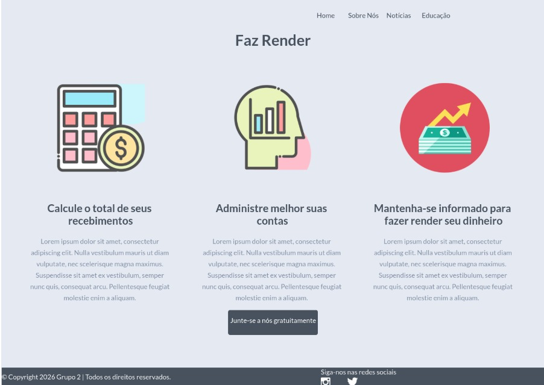
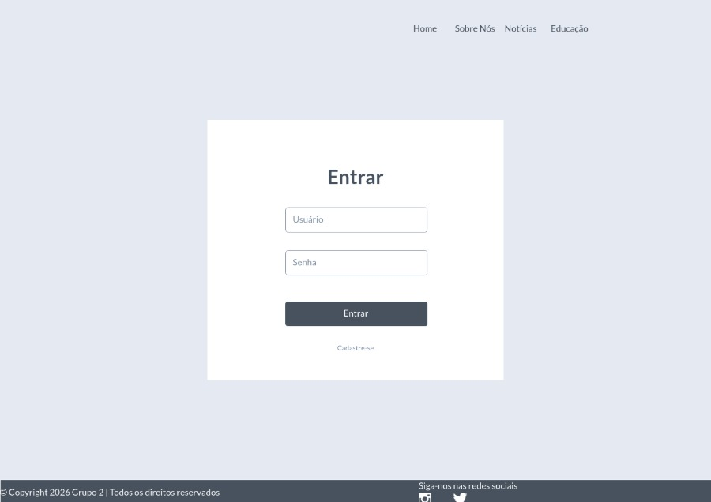
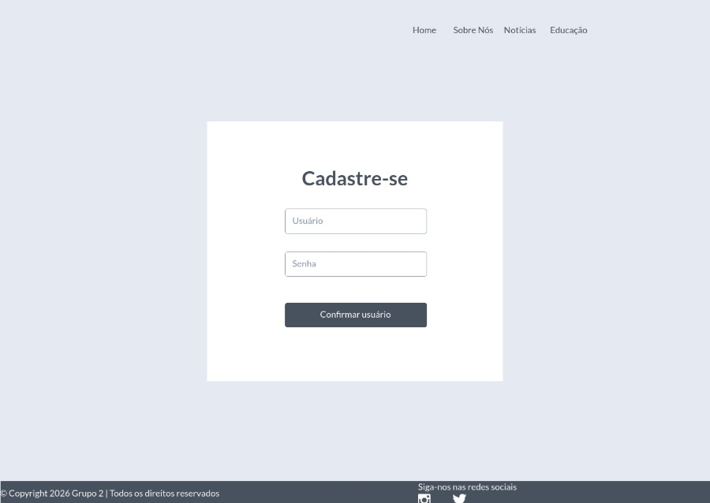
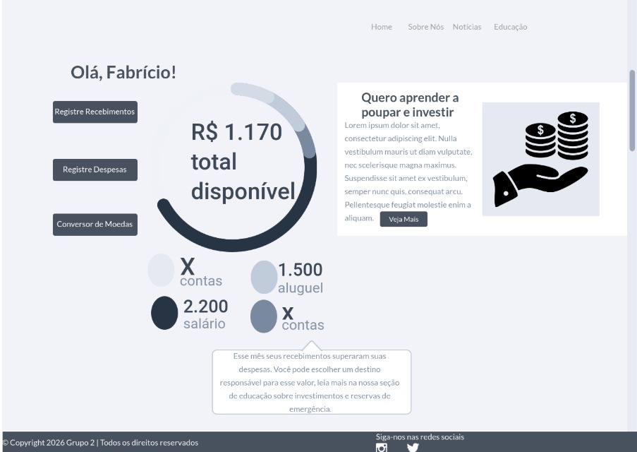
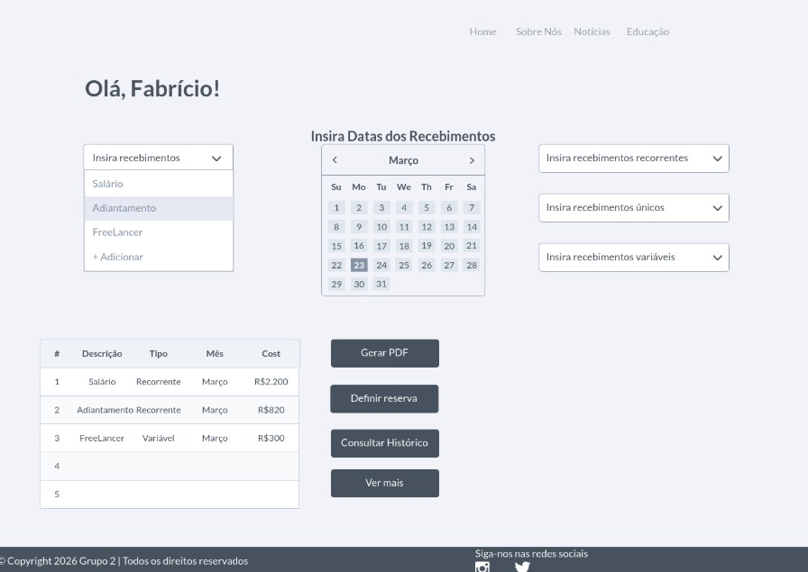
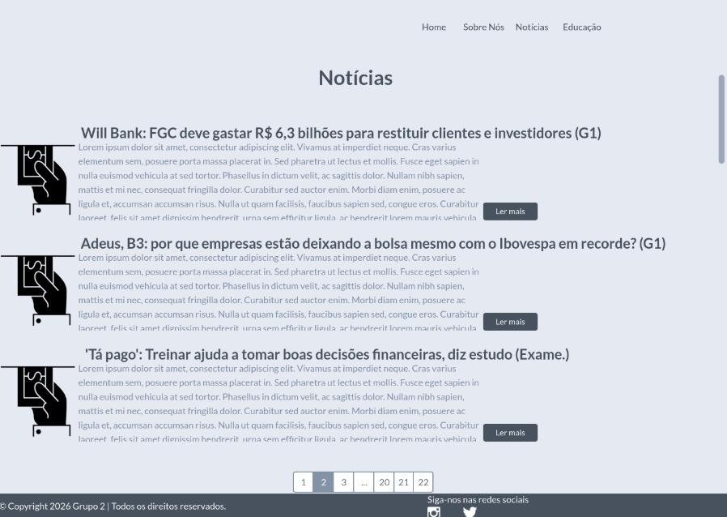
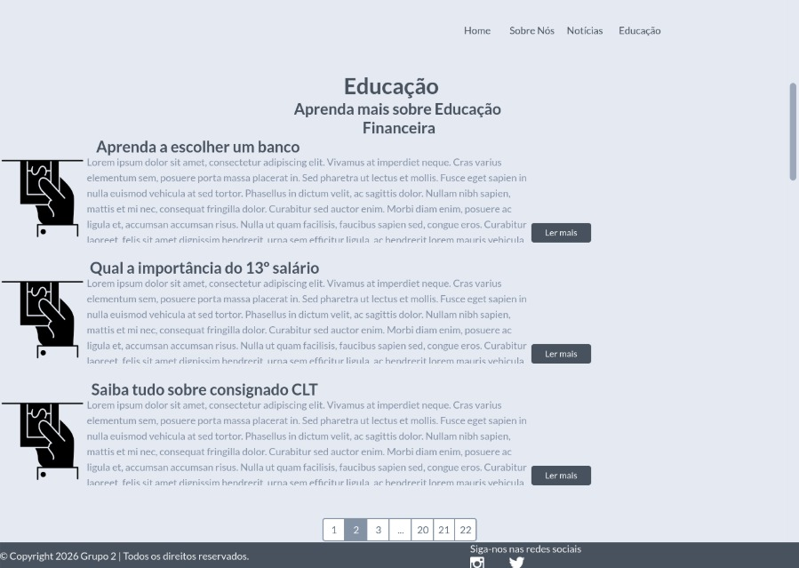
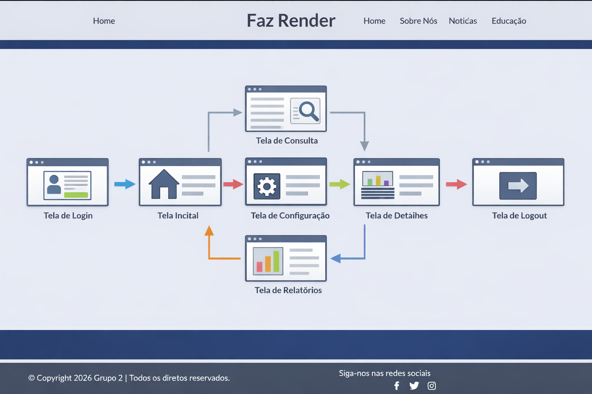

# Projeto de Interface
O fluxograma da abaixo ilustra o percurso de interação do usuário pelas diferentes telas do sistema.

## User Flow

Figura 1 - Fluxo de telas do usuário 

## Protótipo

As telas do sistema seguem uma estrutura padronizada, ilustrada a baixo. Essa composição é organizada em três grandes blocos, descritos a seguir:

    Cabeçalho: área superior que apresenta o nome da aplicação web e o menu principal de navegação.

    Conteúdo: região central destinada à exibição das informações e funcionalidades específicas de cada tela.

    Rodapé: seção inferior que contém informações institucionais e de direitos autorais

Figura 2 - Estrutura da aplicação

### Protótipo de baixa fidelidade

Tela – Home Page

A página inicial apresenta uma composição organizada em seções visuais que destacam os principais recursos da aplicação.

•	Apresenta a funcionalidade de cálculo de gastos e rendimentos do usuário.
•	Disponibiliza recursos para administrar melhor as despesas pessoais.
•	Oferece orientações e possibilidades para otimizar a aplicação das finanças do usuário.

Figura 3 - Estrutura da Home Page

Tela – Login

A tela de Login apresenta campos para a inserção do e-mail e da senha, e a funcionalidade de manter-se logado. 

Figura 4 - Tela de acesso do usuario a sua conta.

Tela – Usuário Logado

A tela de usuário logado apresenta a área personalizada do sistema, exibindo informações do perfil, opções de navegação específicas e acesso rápido às principais funcionalidades da aplicação.

Figura 5 - Tela do usuario logado.

Tela - Cadastro de Despesas

A tela de cadastro de despesas foi projetada para facilitar o controle financeiro do usuário. Sua organização segue a estrutura padrão do sistema, composta por cabeçalho, conteúdo e rodapé.

Figura 6 - Tela de cadastro de despesas do usuario.

Tela – Notícias sobre Finanças

A tela de notícias apresenta conteúdos atualizados sobre o mercado financeiro, economia e educação financeira. Nela, o usuário pode acessar artigos, comunicados e informações relevantes que auxiliam na tomada de decisões e no melhor gerenciamento de suas finanças.

Figura 7 - TNotícias sobre Finanças.

Tela – Educação Financeira

A tela de educação financeira disponibiliza conteúdos voltados para o aprendizado e conscientização sobre o uso do dinheiro. Nela, o usuário encontra artigos, dicas práticas e materiais educativos que auxiliam na construção de hábitos financeiros mais saudáveis e na tomada de decisões responsáveis.

Figura 8 - TNotícias sobre Educação Financeira.