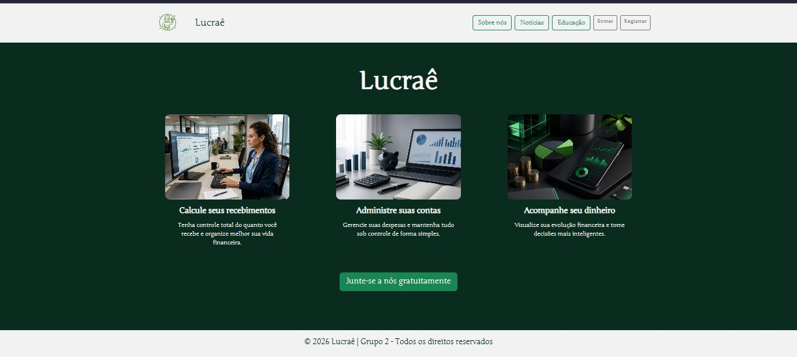
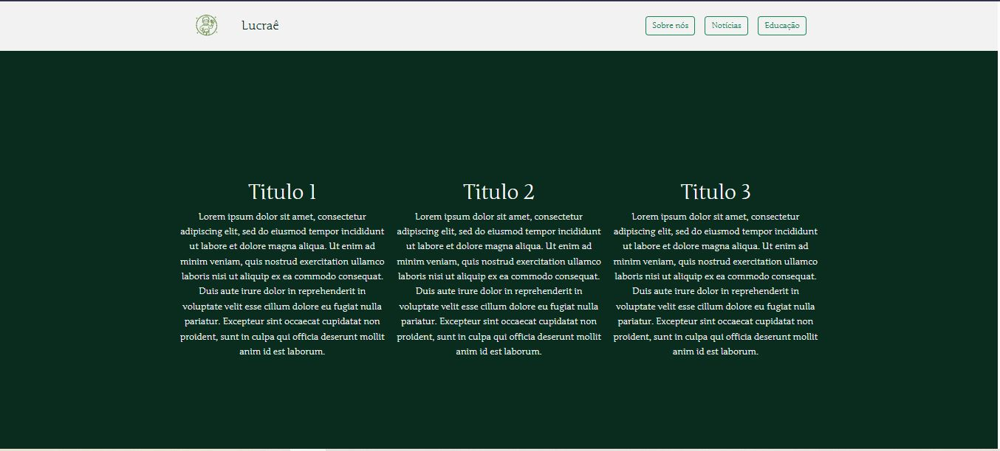

**Template padrão da Aplicação.**

O layout principal do site foi desenvolvido utilizando as linguagens de marcação HTML e CSS, enquanto o JavaScript e Bootstrap na construção do layout responsivo.

As páginas terão como elementos fixos o menu de navegação, o header e o footer, além dos componentes de identidade visual descritos a seguir:

● Cores: RGB: color: #092c1f verde escuro;  #ffffff branco e  rgba(0,0,0,0.15) cinza.

● Font-family: 'Junge', serif e bold.

● Font-size: 18px. 

Figura 1 - Tela de inicial da aplicação.

Figura 2 - Tela Noticias.  

Figura  - LogoLogotipo da aplicação web LucraÊ 

Para a criação do logotipo do site foi utilizada a cor verde, escolhida por sua associação à prosperidade e ao sucesso financeiro. A figura de um jovem em postura confiante, segurando notas de dinheiro, foi selecionada para transmitir atitude, segurança e domínio sobre questões econômicas. O círculo com ornamentos ao redor reforça a ideia de identidade e marca registrada, criando um símbolo que remete diretamente à autoconfiança e ao alcance de objetivos relacionados à gestão financeira.

> **Links Úteis**:
>
> - [CSS Website Layout (W3Schools)](https://www.w3schools.com/css/css_website_layout.asp)
> - [Website Page Layouts](http://www.cellbiol.com/bioinformatics_web_development/chapter-3-your-first-web-page-learning-html-and-css/website-page-layouts/)
> - [Perfect Liquid Layout](https://matthewjamestaylor.com/perfect-liquid-layouts)
> - [How and Why Icons Improve Your Web Design](https://usabilla.com/blog/how-and-why-icons-improve-you-web-design/)
