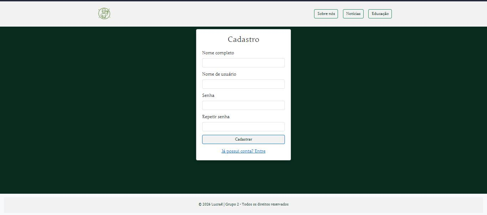
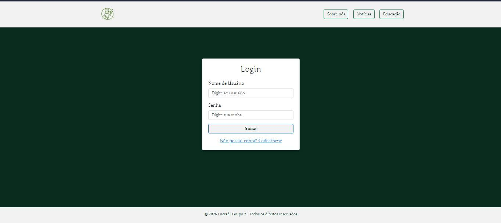
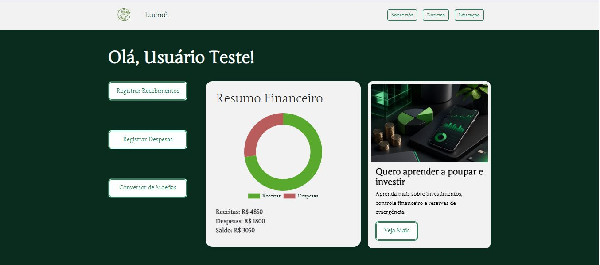

**Tela de cadastro:**

Requisitos atendidos:

RF-001: O site deve permitir ao usuário cadastrar uma conta.

Artefatos da funcionalidade

●register.html

●global.css

●dashboard.css

**Tela de acesso:**

Requisitos atendidos:

RF-001: O site deve permitir ao usuário cadastrar uma conta.

Artefatos da funcionalidade

●login.html

●global.css

●dashboard.css

**Tela Usuario Logado:**

RF-003: O usuário deve poder classificar as entradas e saídas financeiras em categorias.

Artefatos da funcionalidade

●dashboard.html

●global.css

●dashboard.css

> **Links Úteis**:
> - [Trabalhando com HTML5 Local Storage e JSON](https://www.devmedia.com.br/trabalhando-com-html5-local-storage-e-json/29045)
> - [JSON Tutorial](https://www.w3resource.com/JSON)
> - [JSON - Introduction (W3Schools)](https://www.w3schools.com/js/js_json_intro.asp)
> - [JSON Tutorial (TutorialsPoint)](https://www.tutorialspoint.com/json/index.htm)

