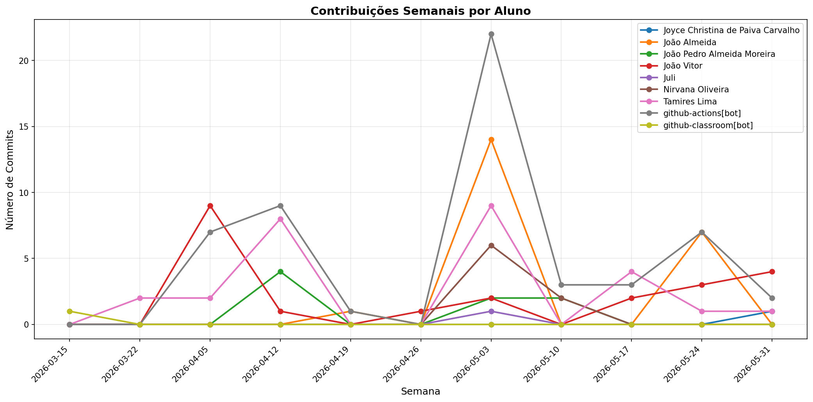

# 📊 Relatório de Contribuições do Projeto

**Última atualização:** 07/06/2026 16:28

---

## 📈 Resumo Geral de Contribuições

| Aluno                             |   Commits |   Linhas+ |   Linhas- |   Arquivos |   Docs Commits |   Docs Arquivos |
|-----------------------------------|-----------|-----------|-----------|------------|----------------|-----------------|
| Joyce Christina de Paiva Carvalho |         1 |         1 |         5 |          1 |              0 |               0 |
| João Almeida                      |        22 |      2420 |       660 |         44 |              2 |               0 |
| João Pedro Almeida Moreira        |         8 |        26 |        20 |          4 |              7 |               2 |
| João Vitor                        |        22 |       453 |       213 |         18 |             12 |               3 |
| Juli                              |         1 |        58 |         9 |          3 |              0 |               0 |
| Nirvana Oliveira                  |         8 |       747 |        94 |         15 |              1 |               0 |
| Tamires Lima                      |        27 |       563 |       272 |         34 |             22 |               3 |
| github-actions[bot]               |        54 |       391 |       326 |          3 |             53 |               1 |
| github-classroom[bot]             |         1 |       774 |         0 |         19 |              1 |               3 |

## 📅 Contribuições Semanais (Todo o Semestre)

**2026-05-31**: Joyce Christina de Paiva Carvalho: 1, João Vitor: 4, Tamires Lima: 1, github-actions[bot]: 2

**2026-05-24**: João Almeida: 7, João Vitor: 3, Tamires Lima: 1, github-actions[bot]: 7

**2026-05-17**: João Vitor: 2, Tamires Lima: 4, github-actions[bot]: 3

**2026-05-10**: João Pedro Almeida Moreira: 2, Nirvana Oliveira: 2, github-actions[bot]: 3

**2026-05-03**: João Almeida: 14, João Pedro Almeida Moreira: 2, João Vitor: 2, Juli: 1, Nirvana Oliveira: 6, Tamires Lima: 9, github-actions[bot]: 22

**2026-04-26**: João Vitor: 1

**2026-04-19**: João Almeida: 1, github-actions[bot]: 1

**2026-04-12**: João Pedro Almeida Moreira: 4, João Vitor: 1, Tamires Lima: 8, github-actions[bot]: 9

**2026-04-05**: João Vitor: 9, Tamires Lima: 2, github-actions[bot]: 7

**2026-03-22**: Tamires Lima: 2

**2026-03-15**: github-classroom[bot]: 1

## 📊 Visualização Gráfica

## ℹ️ Observações

- **Commits**: Número total de commits realizados

- **Linhas+**: Linhas de código adicionadas

- **Linhas-**: Linhas de código removidas

- **Arquivos**: Número de arquivos únicos modificados

- **Docs Commits**: Commits em arquivos de documentação

- **Docs Arquivos**: Arquivos de documentação modificados

---

*Relatório gerado automaticamente via GitHub Actions*
